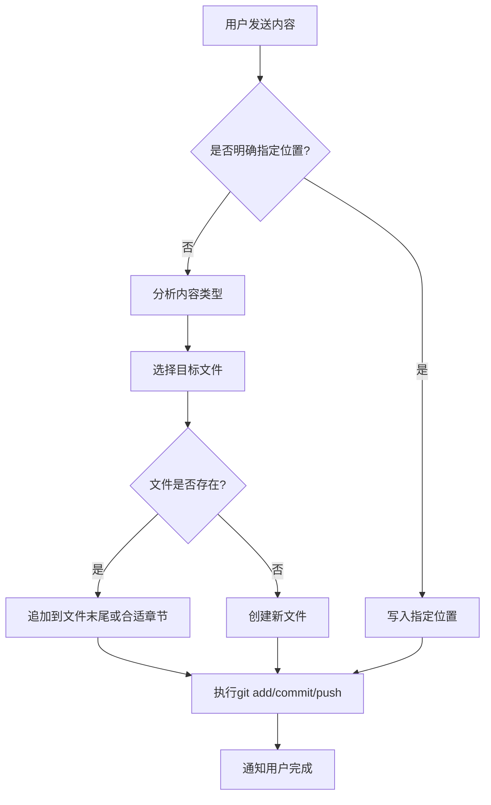

# 智能写入系统

## 📝 系统概述

当用户在聊天窗口发送内容时，Kimi会自动识别内容类型，并写入到正确的文件夹和位置。

---

## 🎯 识别规则

### 1. 用户明确指定位置（最高优先级）
**触发词示例：**
- "写到Daily/2026-02-23.md"
- "记录到Knowledge/AI学习笔记"
- "添加到Inbox"
- "更新MOC/日记索引"

**执行：** 严格按照用户指定的路径写入

---

### 2. 自动识别内容类型

| 内容类型 | 关键词 | 目标位置 | 示例 |
|---------|--------|---------|------|
| **日记/日常记录** | "今天"、"昨天"、"刚才"、"早上"、"晚上" | `Daily/YYYY-MM-DD.md` | "今天见了张三讨论项目" |
| **知识笔记** | "学习"、"笔记"、"总结"、"技术"、"方法" | `Knowledge/` | "学习了Python异步编程" |
| **灵感/想法** | "想法"、"灵感"、"突然想到"、"点子" | `Inbox/` | "突然想到一个产品功能" |
| **AI相关需求** | "AI需求"、"产品想法"、"功能设计" | `Knowledge/AI需求清单.md` | "想做一个AI写作助手" |
| **长文材料** | 包含markdown格式、链接、较长内容 | `Knowledge/参考材料/` | 粘贴的文章、访谈内容 |
| **任务/待办** | "TODO"、"待办"、"提醒"、"任务" | `Inbox/待办事项.md` | "明天要完成周报" |

---

## 🔄 处理流程



---

## 💡 智能决策示例

### 示例1：日常对话
**用户：** "今天下午和团队开会，讨论了产品路线图，决定先做MVP版本"

**识别：**
- 关键词：今天、下午、开会 → 日记类型
- 时间：2026-02-23

**执行：**
```markdown
写入到：Daily/2026-02-23.md

## 工作记录
- 14:00 团队会议：讨论产品路线图
  - 决策：优先开发MVP版本
  - 参与人：团队全员
```

---

### 示例2：知识笔记
**用户：** "学习了Obsidian的Dataview插件，可以用来自动汇总笔记统计"

**识别：**
- 关键词：学习、插件 → 知识笔记
- 主题：Obsidian

**执行：**
```markdown
写入到：Knowledge/Obsidian学习笔记.md

## Dataview插件
- **功能：** 自动汇总笔记统计
- **学习日期：** 2026-02-23
- **应用场景：** 
  - 统计每日笔记数量
  - 按标签分类汇总
```

---

### 示例3：灵感记录
**用户：** "突然想到，可以做一个AI日记分析工具，自动提取情绪和关键事件"

**识别：**
- 关键词：突然想到、可以做 → 灵感/产品想法
- 主题：AI工具

**执行：**
```markdown
写入到：Knowledge/AI需求清单.md

## AI日记分析工具
- **灵感来源：** 2026-02-23 随想
- **核心功能：**
  - 自动提取情绪变化
  - 识别关键事件
  - 生成情绪趋势图
- **状态：** 💡 灵感阶段
```

---

## 🎨 格式规范

### 日期格式
- 统一使用 `YYYY-MM-DD` 格式
- 文件名：`2026-02-23.md`

### 章节规范
```markdown
# 日记标题（如果是Daily）

## 工作记录
- 内容

## 生活动态
- 内容

## 学习笔记
- 内容

## Kimi工作日志
- 内容（由定时任务自动写入）

## AI行业动态
- 内容（由定时任务自动写入）
```

### 知识笔记规范
```markdown
# 笔记标题

**创建时间：** YYYY-MM-DD
**标签：** #主题 #分类

## 核心内容
...

## 相关链接
- [[相关笔记1]]
- [[相关笔记2]]
```

---

## ⚙️ 执行规则

### 自动操作（无需确认）
1. 写入/修改文件
2. 执行 `git add -A`
3. 执行 `git commit -m "描述"`
4. 执行 `git push origin main`
5. 简单通知用户

### 需要确认的操作
1. 删除重要文件（.md文件）
2. 大规模重构（涉及>5个文件）
3. 不确定用户意图时

---

## 🔒 安全保障

1. **永不丢失.md文件：** 删除前必须确认
2. **保留历史：** 所有操作都通过Git版本控制
3. **备份分支：** 重大操作前创建备份分支
4. **数据验证：** 写入前检查内容格式

---

## 📊 使用统计（自动更新）

- **启用日期：** 2026-02-23
- **总写入次数：** _待统计_
- **最近写入：** _待更新_

---

_本文档由Kimi维护，最后更新：2026-02-23_